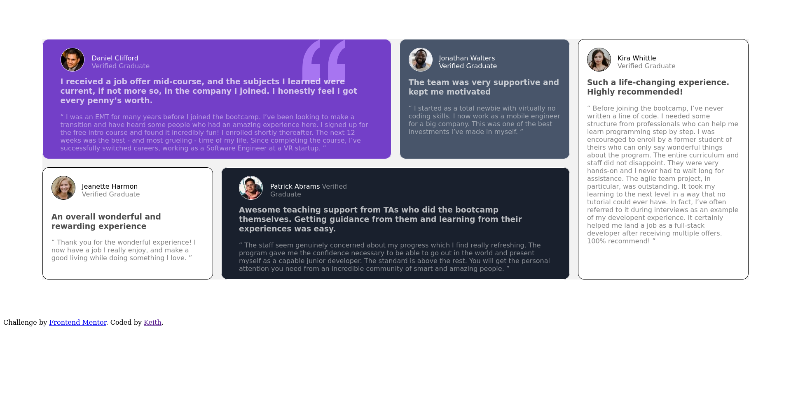
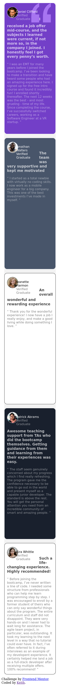

# Frontend Mentor - Testimonials grid section solution

This is a solution to the [Testimonials grid section challenge on Frontend Mentor](https://www.frontendmentor.io/challenges/testimonials-grid-section-Nnw6J7Un7). Frontend Mentor challenges help you improve your coding skills by building realistic projects. 

## Table of contents

- [Overview](#overview)
  - [The challenge](#the-challenge)
  - [Links](#links)
- [My process](#my-process)
  - [Built with](#built-with)
  - [What I learned](#what-i-learned)
  - [Continued development](#continued-development)
- [Author](#author)
- [Screenshot](#screenshot)

## Overview

### The challenge

Users should be able to:

- View the optimal layout for the site depending on their device's screen size

**Note: Delete this note and the paragraphs above when you add your screenshot. If you prefer not to add a screenshot, feel free to remove this entire section.**

### Links

- Solution URL: [[Add solution URL here](https://www.frontendmentor.io/solutions/testimonials-grid-6hsn0BDVYU))]
- Live Site URL: [[Add live site URL here](https://keithgaines.github.io/testimonials_grid/)]

## My process

### Built with

- Semantic HTML5 markup
- CSS custom properties
- CSS Grid
- Mobile-first workflow

### What I learned

CSS Fundamentals: By building this website using vanilla CSS, I was able to reinforce my understanding of the basics of CSS, such as the box model, selectors, and the use of different properties and values.

CSS Grid: I learned how to use CSS Grid to create a responsive layout without the use of a front-end framework such as Bootstrap. I was able to create a grid system to place the testimonial blocks, which allowed me to control their placement and size.

Custom Styling: I learned how to create custom styles for my website, rather than relying on pre-existing styles from a framework. This gave me more control over the design and allowed me to create a unique look for my website.

Problem-solving: By working with vanilla CSS, I was able to sharpen my problem-solving skills, as I had to find creative solutions to common web design challenges without the aid of pre-built components.

Browser Compatibility: I gained a deeper understanding of how to make sure my website works across different browsers and devices, which is essential for building accessible and user-friendly websites.

### Continued development

As a committed web developer, I am dedicated to expanding my skills and knowledge in both vanilla CSS and modern front-end technologies. I have honed my CSS skills by building websites without the use of front-end frameworks, and I am eager to further develop my expertise in this area.

In addition, I am eager to branch out into the world of React, a popular JavaScript library for building user interfaces. By combining my strong CSS skills with my ability to work with React, I am confident in my ability to create dynamic and interactive websites that meet the needs of modern web users.

With a focus on continued learning and professional growth, I am excited to explore new challenges and opportunities in the field of web development.

## Author

- Website - [Keith Gaines](https://keithgaines.github.io)
- Frontend Mentor - [@keithgaines](https://www.frontendmentor.io/profile/keithgaines

### Screenshot

